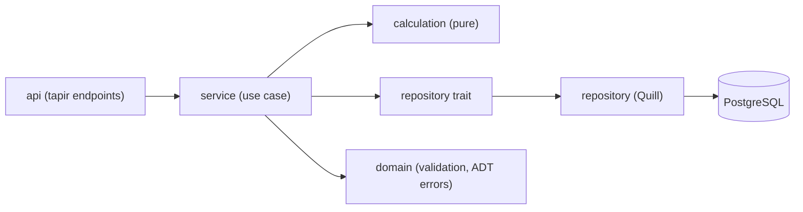

# AGENTS — правила разработки и ревью

Цель документа: зафиксировать критичные инварианты проекта в коротком виде,
чтобы изменения не ломали архитектуру, контракты API и эксплуатацию.

## 0. Текущее состояние и запуск

- Проект на нулевом этапе: исходного кода ещё нет. Спецификация — `docs/a-tes.md`.
- Репозиторий ещё не инициализирован (`git` не настроен) — git/gh-команды не запускать.
- Целевой стек: Scala 3.8.4, sbt 2.0.6, JDK 21; ZIO, tapir, Flyway, Quill
  (Postgres), scalafmt. В `build.sbt` зависимостей пока нет — добавлять по мере
  реализации.
- Плагины sbt (scalafmt, ...) и `.scalafmt.conf` ещё не созданы — добавить при
  первой необходимости.

## 1. Базовые принципы

- Перед любым ответом сначала искать и читать релевантный контекст в проекте.
- Думай end-to-end: сначала поведение и контракт, потом реализация.
- DDD + Clean Architecture: зависимости направлены только внутрь, жёстко и без исключений.
- SSOT везде, где есть правила, ошибки, доступ, сериализация и конфиги.
- Выбирай наиболее сильное и целостное решение, не упрощай без явной причины.
- Не завершать задачу, пока не собран весь необходимый контекст.
- Предпочитать ясный, расширяемый нейминг; при рефакторинге удалять мёртвый код.
- Не делать «временных» TODO-рефакторов, если улучшение безопасно сделать сразу в рамках задачи.
- Не запускать мутирующие git-команды без явного запроса пользователя.
- IDEA MCP использовать для диагностики и инспекций; не использовать как редактор.
- Для операций с GitHub использовать `gh`.

## 1.1 Форматирование и коммуникация

- Единый формат кода — scalafmt (`.scalafmt.conf`, `maxColumn = 120`, trailing commas):
  форматировать через `sbt scalafmtAll`, проверять через `sbt scalafmtCheckAll`.
- Документацию и ответы писать в Markdown со сканируемой структурой.
- Писать короткими абзацами в формате «одна мысль — один абзац».

## 2. Слои и зависимости

- Слои `calculation`/`service`/`repository`/`api` — целевая архитектура по роадмапу
  (см. §0), пока не реализованы; инварианты ниже обязательны при их создании.
- `domain`: бизнес-инварианты, политики, case class'ы, `opaque type`, `enum`,
  ADT доменных ошибок, чистые функции без эффектов.
- `calculation`: чистые функции расчёта (без ZIO-эффектов) — легко юнит-тестировать.
- `service`: оркестрация, валидация (через доменные smart-конструкторы),
  вызов репозиториев; не хранит бизнес-правила как SSOT.
- `repository`: трейты интерфейсов + Quill-реализации поверх Postgres.
- `api`: tapir-описания эндпоинтов, server logic, маппинг ошибок, сериализация.
- `db`: HikariCP/DataSource layer, Quill Context, Flyway-миграции.
- `domain` не импортирует `repository`/`db`; `api` не ходит в репозитории напрямую.

## 3. SSOT и централизация

- Ошибки: единый `enum DomainError` — SSOT типов ошибок в error-канале
  `ZIO[R, DomainError, A]`; маппинг `DomainError -> HTTP` и `{ "error": ... }`
  — один объект в `api/`.
- Один сервис = один `trait` + `object` с `val layer: ZLayer[...]`; граф слоёв
  собирается только в `Main` (единая точка композиции).
- Дополнительные проверки доступа через отдельный слой-сервис допустимы,
  но baseline всегда проходит через явные доменные политики/валидаторы.
- Пагинация только через общий helper (limit/offset).
- Константы и «магия» — в `domain/` рядом с правилом; отдельный `Constants.scala`
  заводится при первом использовании (сейчас файла нет).
- Feature toggles и дефолты интеграций не размазывать по слоям.
- Конфиг централизован через `zio-config` (`deriveConfig` + `nested`, env-оверрайды
  вида `value = ${?ENV_VAR}`), без хардкода в коде.

## 4. Контракты service / repository / api

- Один метод сервиса = одна операция, stateless; команды/результаты — case class'ы
  в том же файле.
- Сервис не импортирует Quill и не открывает транзакции БД напрямую.
- API (tapir server logic) принимает примитивы/DTO, не сущности; не знает роли
  и не делает бизнес-авторизацию.
- API нормализует/парсит примитивы (например, `String -> Long`), но не делает
  бизнес-валидацию; SSOT в `domain` через smart-конструкторы (`X.from(...)`)
  и доменные валидаторы.
- API не использует репозитории напрямую даже для чтения.
- Репозиторий не содержит бизнес-логики и не вызывает сервисы.
- Для race-сценариев репозитории дают атомарные методы
  (`selectForUpdate`, check-and-update, unique-constraints, идемпотентность).

## 4.1 DI и обязательные зависимости

- Все сервисы зарегистрированы в графе `ZLayer` и корректно связаны в `Main`.
- При изменении конструктора сервиса граф слоёв обновляется в том же изменении.
- Зависимости сервисов не делать optional для «починки» wiring/tests.
- В тестах передавать все обязательные зависимости явно (через `ZLayer.succeed`
  с моками), без ветвлений в API на «отсутствующий сервис».

## 5. Запрет фолбэков и «магического» доступа

- Никаких silent fallback-ов и «автодогадок» в domain/repository/service/api.
- Обязательное значение отсутствует → fail-fast с понятной ошибкой
  (typed error channel, не `getOrElse`-дефолты).
- Не маскировать ошибки данных дефолтами или «best effort» маппингом
  (не `asInstanceOf`, не `null`, не `Any`-касты).

## 6. Правила типизации

- `Option[T]` вместо nullable; `null` и `""` не используются как маркеры
  отсутствия ошибки — только типизированный error channel.
- Контракт результатов единообразный: `A`, `Option[A]`, `Either[DomainError, A]`,
  `ZIO[R, DomainError, A]`; для статусов/ошибок — typed channel, не неявные флаги.
- Возвраты проектировать предсказуемо; доменные примитивы оборачивать в
  `opaque type` с smart-конструкторами `from(...): Either[DomainError, T]`.
- Интерфейсы сервисов/репозиториев — обычные `trait` (реализации — `object`);
  зависимости выражать типом, не строками.

## 6.1 Optionality

- Делать поле `Option[T]` только когда отсутствие значения допустимо доменной логикой.
- «На всякий случай» optional запрещён.
- При переходе `optional -> required` фиксировать миграционный путь (Flyway)
  и добавлять тесты на корректные дефолты/инициализацию.

## 7. API-контракт

- Контракт эндпоинтов описывается декларативно через tapir; OpenAPI/Swagger
  генерируется автоматически и является зеркалом кода.
- Server logic использует только сервисы; авторизация в tapir — аутентификация,
  бизнес-доступ проверяется в сервисе.
- Ошибки в API: единый маппинг `DomainError -> HTTP`; успех определяется
  HTTP-статусом; тело ошибки — `{ "error": "...", ... }`.
- Сериализация через zio-json (`DeriveJsonCodec.gen`), кодеки не размазывать
  по слоям.
- Любое stricter-поведение API обязательно отражать в OpenAPI/Swagger и тестах;
  при изменении поведения обновлять endpoint-описание в том же изменении.

## 8. Дата/время и сериализация

- В домене и репозиториях использовать `java.time.Instant` (tz-aware, UTC),
  не ISO-строки и не `LocalDate`/`LocalDateTime` без зоны.
- В API сериализовать datetime как ISO 8601 UTC (`Z`) через zio-json codec.
- Текущее время брать через `Clock` как `ZLayer` (не `Instant.now()` в сервисах),
  чтобы в тестах использовать `TestClock`.
- Локальное wall-clock время допустимо, когда это явно часть контракта
  endpoint-а, и только в `api`-слое.
- Не использовать `new java.util.Date` / `System.currentTimeMillis` ad-hoc.

## 9. Критичные инварианты данных

- Бизнес-дефолты запрещены в миграциях:
  - доменные поля `NOT NULL` без `DEFAULT` (валидация на границе домена),
  - бизнес-инициализация только в domain/сервисе.
- Технические дефолты разрешены только для инфраструктурных полей
  (`created_at`, `updated_at`, soft-delete/archive flags).
- Архивация (`is_archived`) вместо физического удаления; тех-сущности
  скрываются из публичной выдачи.
- Для критичных `is_*` флагов:
  - SSOT определён явно,
  - миграция + backfill в одном батче,
  - idempotent ensure-методы поднимают флаг обратно,
  - update-потоки не затирают флаг.

## 10. Наблюдаемость

- Логгирование только через zio-logging; единая инициализация (logger layer,
  `Runtime.removeDefaultLoggers`) — централизованно в `Main`.
- Ошибки логировать через типизированный канал и/или централизованные
  helper-функции; не полагаться на `println`/`System.out`.
- Неожиданные исключения в API должны попадать в единый маппинг/обработчик
  ошибок server logic.
- SLF4J-бэкенд используется только через `zio-logging-slf4j2-bridge`.

## 11. Терминология и нейминг

- Нейминг должен отражать доменный смысл и быть расширяемым.
- Использовать единые доменные термины (Task/Popug/Assignment/Account/
  AuditLog); не вводить синонимы для одного понятия.

## 12. Процесс качества перед финализацией

- Проверки по изменённым Scala-модулям:
  - `sbt scalafmtCheckAll` (формат), при правках — `sbt scalafmtAll`,
  - `sbt compile` — строгие `scalacOptions` (`-Wunused:all`, `-Wvalue-discard`,
    `-Werror`): варнинги не скрывать, а исправлять причину.
- Запускать IDE inspections по изменённым файлам и исправлять ошибки/варнинги.
- После завершения задачи запускать полный тестовый прогон: `sbt test`.
- Не запускать только часть тестов, если пользователь явно не попросил.
- В конце задачи писать короткий отчёт в несколько фраз о проделанной работе.

## 13. Стиль тестов (ZIO Test)

- Юнит-тесты: `suite` / `test` / `assertTrue`; для времени — `TestClock`,
  для зависимостей — `provideLayer` с моками.
- Готовые сценарии в domain/calculation покрываются тестами в первую очередь
  (граничные случаи: rand-расчёты, ассайн, аккаунтинг).
- Интеграционные тесты репозиториев (при наличии) — через testcontainers-scala.
